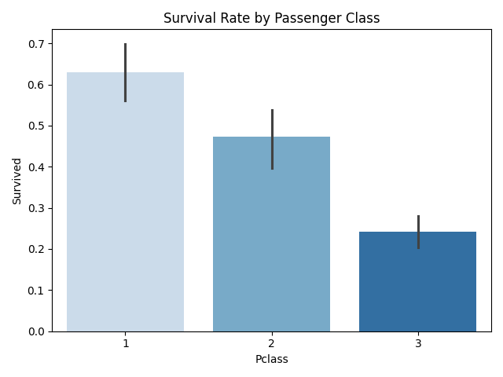

# 🛳️ Titanic Data Analysis Project  

**Keyla Agurto | M.S. Data Science Student (Geospatial Analytics) at Old Dominion University**  

This project analyzes the famed **Titanic dataset** using Python (`pandas`, `matplotlib`, `seaborn`) to uncover survival patterns and insights. It demonstrates core skills in data cleaning, exploratory data analysis (EDA), visualization, and storytelling — all of which are critical for entry-level data analyst roles.

---

## 🎯 Motivation & Problem Statement  
In analytics roles, identifying key drivers from historical data is essential. The Titanic dataset provides a rich, well-known sandbox for practicing this. This project is built to answer:  
- Who was more likely to survive the disaster, and why?  
- How did factors like gender, class, age, and family size impact survival rates?  
By exploring these factors, this project demonstrates how one can transform raw data into actionable insights — the same kind of work that powers business dashboards and strategic decision-making.

---

## 🧰 Tools & Libraries  
| Tool | Role in the Project |
|------|--------------------|
| **Python** | Data scripting and analysis |
| **pandas** | Data cleaning and transformation |
| **matplotlib** | Static chart creation |
| **seaborn** | Enhanced statistical visuals |
| **Git & GitHub** | Version control and portfolio hosting |
| **VS Code** | Development environment |
| **GitHub Pages / README images** | Presentation and project sharing |

---

## 📊 Key Analyses & Visuals  
1. **Survival by Gender** – A dramatic difference between male and female survival rates.  
2. **Survival by Passenger Class (Pclass)** – Illustrates how first-class passengers had a significantly higher survival rate.  
3. **Survival by Age Group** – Shows how age groups (Children, Teens, Young adults, Adults, Seniors) had varying survival odds.  
4. **Survival by Family Size** – Explores the correlation between travelling alone vs. with family and outcomes.  
5. **Correlation Heatmap of Numeric Features** – Presents an overview of how features like Age, Fare, Sex, and Class relate to survival.  

#### Example Visuals  
| Visualization | Description |
|--------------|-------------|
|  | Survival Count by Gender |
|  | Survival Rate by Passenger Class |
|  | Survival Rate by Age Group |
|  | Survival Rate by Family Size |
|  | Correlation Heatmap of Titanic Features |

---

## 🔍 Project Workflow  
1. **Load the dataset** (`train.csv`) into pandas.  
2. **Inspect & clean data** – handle missing values, drop irrelevant columns, map categorical to numeric.  
3. **Feature engineering** – created new columns for AgeGroup, FamilySize, and Alone flag.  
4. **Exploratory analysis** – used groupings and visualizations to uncover patterns.  
5. **Visualization** – presented key insights via charts and saved them as `.png` files.  
6. **Save cleaned data** – exported the processed dataset (`titanic_cleaned.csv`) for future use.  
7. **Documentation** – uploaded code, images, and README to GitHub for portfolio visibility.  

---

## 💡 Insights Summary  
- Women were significantly more likely to survive than men in this disaster.  
- First-class passengers had a much higher survival rate, highlighting the role of social status and access.  
- Younger passengers (children and teens) often had higher survival odds compared to seniors.  
- Travelling alone increased risk – family companionship correlated with better outcomes.  
- The correlation heatmap reinforced that factors like Sex, Pclass, and FamilySize had the strongest relationship with survival.

---

## 📁 Repository Structure  
